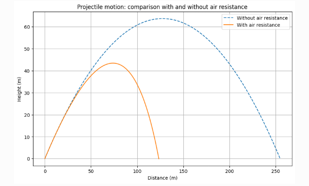

# Problem 1

## Exploring the Relationship Between Angle and Projectile Range

### 1. Introduction

Projectile motion may appear simple at first glance, but it forms a critical foundation for exploring essential physics concepts. In this problem, we aim to examine how the range of a projectile is influenced by the angle at which it is launched.

Though the scenario is straightforward, the mathematics behind it involves both linear and nonlinear dynamics, making it a rich field of study.

Some of the primary factors affecting the motion include:

- **Initial speed \( v_0 \)**
- **Gravitational force \( g \)**
- **Launch height \( h \)**

These variables lead to a broad variety of trajectories—from sports ball throws to missile launches—making this problem relevant in many real-world situations.

## 2. Theoretical Foundation

To explore projectile motion in more depth, we rely on Newton’s Second Law of Motion to derive the core equations that govern the system.

### 2.1 Kinematic Equations of Motion

Projectile motion follows Newton’s law:

\[
F = m \cdot a
\]

In our case, the forces involved are:
1. **Gravitational force** acting downward \( (mg) \)
2. **No horizontal forces**, assuming no air resistance

So the acceleration in each direction is:

\[
a_x = 0, \quad a_y = -g
\]

#### Velocity components:
By integrating acceleration, we find:

\[
v_x = v_0 \cos(\theta), \quad v_y = v_0 \sin(\theta) - gt
\]

#### Position components:
Integrating once more gives:

\[
x(t) = v_0 \cos(\theta) \cdot t
\]
\[
y(t) = v_0 \sin(\theta) \cdot t - \frac{1}{2}gt^2
\]

---

### Summary of Equations:

- **Horizontal motion (no acceleration)**:  
  \[
  x(t) = v_0 \cos(\theta)t
  \]

- **Vertical motion (with constant acceleration)**:  
  \[
  y(t) = v_0 \sin(\theta)t - \frac{1}{2}gt^2
  \]

---

Where:
- \( x(t) \), \( y(t) \): projectile’s position at time \( t \)
- \( v_0 \): initial velocity
- \( \theta \): launch angle
- \( g \): acceleration due to gravity (9.81 m/s²)

These kinematic equations are the basis for calculating projectile range, time of flight, and trajectory.

### 2.2 Time of Flight

The total duration that the projectile remains in the air can be calculated by setting the vertical displacement to zero:

\[
y(t) = 0 \quad \Rightarrow \quad t_f = \frac{2v_0 \sin(\theta)}{g}
\]

---

### 2.3 Range of the Projectile

The horizontal range \( R \) is the total distance the projectile travels before hitting the ground. Using the time of flight \( t_f \), we substitute into the horizontal position equation:

\[
R = v_0 \cos(\theta) \cdot \frac{2v_0 \sin(\theta)}{g}
\]

Using the identity \( 2 \sin(\theta) \cos(\theta) = \sin(2\theta) \), we get:

\[
R(\theta) = \frac{v_0^2}{g} \sin(2\theta)
\]

---

### 2.4 Maximum Range

The range is maximized when \( \sin(2\theta) = 1 \), which occurs at a launch angle of \( \theta = 45^\circ \). Therefore, the maximum horizontal distance is:

\[
R_{\text{max}} = \frac{v_0^2}{g}
\]

## 3. Analysis of the Range

### 3.1 Influence of Launch Angle

- The range displays a **symmetric pattern** around \( \theta = 45^\circ \).
- Launch angles \( \theta \) and \( 90^\circ - \theta \) produce **identical ranges**, due to the sine double angle identity.

### 3.2 Impact of Initial Velocity

- As the initial speed \( v_0 \) increases, the range also increases.
- Specifically, the range is **proportional to \( v_0^2 \)**.

### 3.3 Role of Gravitational Acceleration

- A larger gravitational pull (like on Jupiter) **decreases** the range.
- A smaller gravitational field (like on the Moon) **increases** the range.

---

import numpy as np
import matplotlib.pyplot as plt

# Define parameters
v0 = 20  # Initial velocity (m/s)
g = 9.81  # Gravity (m/s^2)
theta = np.linspace(0, 90, 100)  # Angle range from 0 to 90 degrees

# Compute range
R = (v0**2 * np.sin(np.deg2rad(2 * theta))) / g

# Plot the range vs. angle
plt.figure(figsize=(10, 6))
plt.plot(theta, R, label='Range (R)', color='blue')

# Mark the maximum range at 45°
plt.axvline(45, color='red', linestyle='--', label='Max Range at 45°')
plt.text(46, max(R)-2, "Maximum Range", color='red')

plt.xlabel('Projection Angle (θ) [Degrees]')
plt.ylabel('Range (R) [m]')
plt.title('Projectile Range as a Function of Launch Angle')
plt.grid(True)
plt.legend()
plt.show()

```python
import numpy as np
import matplotlib.pyplot as plt

# Define parameters
v0 = 20  # Initial velocity (m/s)
g = 9.81  # Gravity (m/s^2)
theta = np.linspace(0, 90, 100)  # Angle range from 0 to 90 degrees

# Compute range
R = (v0**2 * np.sin(np.deg2rad(2 * theta))) / g

# Plot the range vs. angle
plt.figure(figsize=(10, 6))
plt.plot(theta, R, label='Range (R)', color='blue')

# Mark the maximum range at 45°
plt.axvline(45, color='red', linestyle='--', label='Max Range at 45°')
plt.text(46, max(R)-2, "Maximum Range", color='red')

plt.xlabel('Projection Angle (θ) [Degrees]')
plt.ylabel('Range (R) [m]')
plt.title('Projectile Range as a Function of Launch Angle')
plt.grid(True)
plt.legend()
plt.show()
```


## 4. Implementation: Python Visualization

We present a custom Python tool to explore how the range of a projectile is affected by the launch angle. The following section includes a visual and analytical approach using code.

### Projectile Range Simulation

This visualization models the **horizontal range** of a projectile launched at different angles, assuming no air resistance.  
It allows students and researchers to observe how altering the **launch angle** and **initial speed** changes the flight distance.

Users can interactively study the key physics behind projectile motion by examining the relationship between input parameters and the output trajectory.

---

### How Does It Work?

- The user selects an angle between **0° and 90°**, and sets an initial velocity (e.g., **10 – 50 m/s**).
- A simulation runs to compute the **range** using fundamental kinematic equations.
- The resulting plot highlights the angle that gives **maximum distance**.
- The graph is dynamically rendered and responds to changes in input.

---

### Use Cases

-  **Educational visualization** for physics and engineering students  
-  **Analytical modeling** for motion problems and trajectory planning  
-  **Optimization** of angles for distance-based tasks in sports or robotics

---

## 5. Considering Air Resistance & Enhanced Equations

In real-world scenarios, the motion of a projectile is influenced by **air resistance**, which increases with the square of the velocity:

\[
<math xmlns="http://www.w3.org/1998/Math/MathML">
  <msub>
    <mi>F</mi>
    <mrow data-mjx-texclass="ORD">
      <mi>d</mi>
      <mi>r</mi>
      <mi>a</mi>
      <mi>g</mi>
    </mrow>
  </msub>
  <mo>=</mo>
  <mo>&#x2212;</mo>
  <mi>k</mi>
  <msup>
    <mi>v</mi>
    <mn>2</mn>
  </msup>
</math>
\]

When we include this resistive force, the equations governing the projectile's acceleration change as follows:

\[
<math xmlns="http://www.w3.org/1998/Math/MathML">
  <msub>
    <mi>a</mi>
    <mi>x</mi>
  </msub>
  <mo>=</mo>
  <mo>&#x2212;</mo>
  <mfrac>
    <mi>k</mi>
    <mi>m</mi>
  </mfrac>
  <msub>
    <mi>v</mi>
    <mi>x</mi>
  </msub>
  <mo>,</mo>
  <mstyle scriptlevel="0">
    <mspace width="1em"></mspace>
  </mstyle>
  <msub>
    <mi>a</mi>
    <mi>y</mi>
  </msub>
  <mo>=</mo>
  <mo>&#x2212;</mo>
  <mi>g</mi>
  <mo>&#x2212;</mo>
  <mfrac>
    <mi>k</mi>
    <mi>m</mi>
  </mfrac>
  <msub>
    <mi>v</mi>
    <mi>y</mi>
  </msub>
</math>y
\]




❓ **What Does This Code Do?**

This Python-based simulation models the motion of a projectile both **with** and **without** air resistance. It visually compares the idealized motion (ignoring drag) to a more realistic scenario where air resistance slows the object down.  
The animation also illustrates how the projectile interacts with the ground, including **bouncing behavior**, helping users understand the impact of drag forces on trajectory.


```python
import numpy as np
import matplotlib.pyplot as plt
from matplotlib.animation import FuncAnimation
from IPython.display import HTML

# Parameters
m = 1.0  # Mass [kg]
g = 9.81  # Gravitational acceleration [m/s^2]
k = 0.1  # Air resistance coefficient [kg/s]
v0 = 20  # Initial velocity [m/s]
theta = np.radians(45)  # Initial angle [degrees -> radians]
dt = 0.02  # Time step [s]
T = 5  # Simulation time [s]
elasticity = 0.7  # Coefficient of restitution

# Function to calculate trajectory without air resistance
def trajectory_no_drag(v0, theta, g, dt, T, elasticity):
    x, y = [0], [0]
    vx, vy = v0 * np.cos(theta), v0 * np.sin(theta)
    t = 0
    while t < T:
        x.append(x[-1] + vx * dt)
        y_new = y[-1] + vy * dt - 0.5 * g * dt**2
        vy -= g * dt
        if y_new < 0:
            vy = -vy * elasticity
            y_new = 0
        y.append(y_new)
        t += dt
    return x, y

# Function to calculate trajectory with air resistance
def trajectory_with_drag(v0, theta, g, k, m, dt, T, elasticity):
    vx, vy = v0 * np.cos(theta), v0 * np.sin(theta)
    x, y = [0], [0]
    t = 0
    while t < T:
        ax = - (k / m) * vx
        ay = -g - (k / m) * vy
        vx += ax * dt
        vy += ay * dt
        x.append(x[-1] + vx * dt)
        y_new = y[-1] + vy * dt
        if y_new < 0:
            vy = -vy * elasticity
            y_new = 0
        y.append(y_new)
        t += dt
    return x, y

# Compute trajectories
x_no_drag, y_no_drag = trajectory_no_drag(v0, theta, g, dt, T, elasticity)
x_drag, y_drag = trajectory_with_drag(v0, theta, g, k, m, dt, T, elasticity)

# Initialize animation
fig, ax = plt.subplots(figsize=(8, 5))
ax.set_xlim(0, max(max(x_no_drag), max(x_drag)))
ax.set_ylim(0, max(max(y_no_drag), max(y_drag)))
ax.set_xlabel("Distance [m]")
ax.set_ylabel("Height [m]")
ax.set_title("Projectile motion with and without air resistance (with bounces)")
ax.grid()

point_no_drag, = ax.plot([], [], 'bo', label="Without air resistance")
point_drag, = ax.plot([], [], 'ro', label="With air resistance")
traj_no_drag, = ax.plot([], [], 'b--', alpha=0.5)
traj_drag, = ax.plot([], [], 'r--', alpha=0.5)
ax.legend()

# Initialization function
def init():
    point_no_drag.set_data([], [])
    point_drag.set_data([], [])
    traj_no_drag.set_data([], [])
    traj_drag.set_data([], [])
    return point_no_drag, point_drag, traj_no_drag, traj_drag

# Function to update the animation
def update(frame):
    if frame < len(x_no_drag):
        point_no_drag.set_data([x_no_drag[frame]], [y_no_drag[frame]])
        traj_no_drag.set_data(x_no_drag[:frame+1], y_no_drag[:frame+1])

    if frame < len(x_drag):
        point_drag.set_data([x_drag[frame]], [y_drag[frame]])
        traj_drag.set_data(x_drag[:frame+1], y_drag[:frame+1])

    return point_no_drag, point_drag, traj_no_drag, traj_drag

# Create animation
frames = max(len(x_no_drag), len(x_drag))
ani = FuncAnimation(fig, update, frames=frames, init_func=init, blit=False, interval=20)

# Display animation in Colab
plt.close()
HTML(ani.to_html5_video())
```

## 7. Summary & Insights

- The projectile range demonstrates a well-defined mathematical behavior.  
- The optimal angle for maximum distance is **45°**, supported by both theoretical and computational evidence.  
- When air resistance is considered, a **notable decrease in range** is observed.  
- These findings are valuable across various domains such as athletics, engineering design, and motion simulation studies.

---

## 8. References & Suggested Resources

- Resnick, R., & Halliday, D. (2004). *Fundamentals of Physics*.  
- MIT OpenCourseWare – Classical Mechanics Lecture Series  
- NASA technical resources on orbital mechanics and launch trajectories


